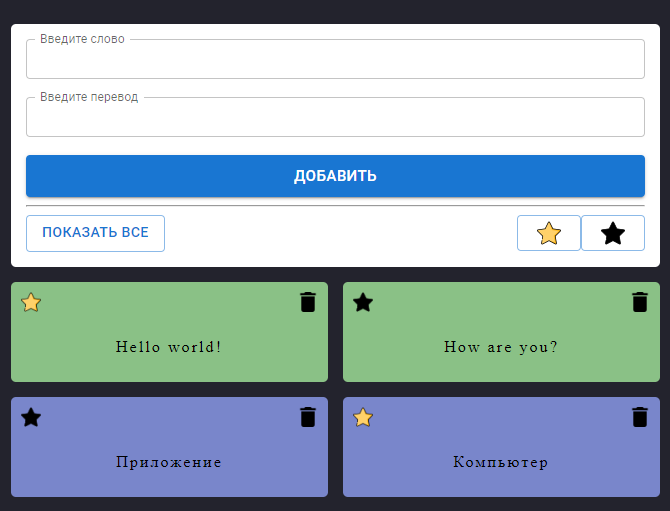

# Cube Money
Приложение для изучения иностранных слов. Проект разработан в учебных целях, для тренировки навыков работы с React, и работы со сторонними библиотеками.



## Содержание
- [Технологии](#технологии)
- [Начало работы](#начало-работы)
- [Разработка](#разработка)
- [Содействие](#содействие)
- [Вопросы](#вопросы)
- [Список задач](#список-задач)
- [Команда проекта](#команда-проекта)
- [Источники](#источники)

## Технологии
- [React](https://react.dev)
- [Redux](https://redux.js.org)
- [React Transition Group](https://reactcommunity.org/react-transition-group)
- [MaterialUI](https://mui.com)

## Начало работы

Внимание! В данный момент проект не запускается. Для того чтобы посмотреть код, на GitHub.com перейдите на главную страницу репозитория, затем:
1. Над списком файлов щелкните Code.
2. Скопируйте URL-адрес репозитория. (Чтобы клонировать репозиторий по протоколу HTTPS, щелкните в разделе "HTTPS")
3. Откройте cmd и выполните команду: 
```sh
git clone <URL-адрес репозитория>
```
4. Откройте проект в любом редакторе кода

## Разработка

### Требования
Для установки и запуска проекта желательно скачать любой редактор кода.

### Установка зависимостей
Не требуется.

## Содействие
Хотите поучаствовать? Если вам интересен [список задач](#список-задач), напишите мне в любом мессенджере.

## Вопросы
Здесь вопросы о частых ошибках.

### Зачем вы разработали этот проект?
Для учебной практики.

### Почему так мало коммитов?
К сожалению, на момент написания, я мало знал про git и github в целом.

## Список задач
- [x] Добавить README
- [ ] Исправить ошибку с запуском проекта и сборкой билда
- [ ] Предложите своё?

## Команда проекта

- [Расул Султанбеков](https://github.com/rasul-surname) — Front-End Developer

## Источники
Отсутствуют
